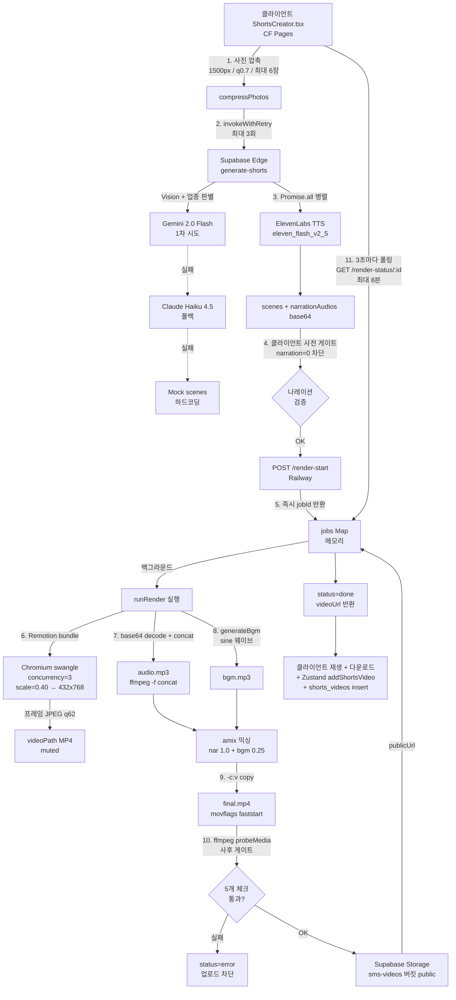

# SMS 쇼츠 영상 제작 파이프라인 분석

> 분석 일자: 2026-04-20  
> 대상 커밋: `69ec1d9` (main)  
> 분석 범위: [ShortsCreator.tsx](../src/components/ShortsCreator.tsx), [generate-shorts/index.ts](../supabase/functions/generate-shorts/index.ts), [video-server/index.js](../video-server/index.js), [video-server/renderer.js](../video-server/renderer.js), [video-server/bgm.js](../video-server/bgm.js), Remotion composition, 루트/video-server `package.json`

---

## 1. 현재 아키텍처 다이어그램



---

## 2. 단계별 평균 소요 시간 (코드 상수 기반)

| 단계 | 위치 | 타임아웃/상수 | 실측 근거 |
|---|---|---|---|
| 사진 압축 | [imageCompress.ts:13](../src/lib/imageCompress.ts#L13) | 클라이언트 Canvas 비동기 | ~500ms/장 × 6장 ≈ 3초 |
| Edge Function invoke | [fetchWithRetry.ts:26](../src/lib/fetchWithRetry.ts#L26) | 기본 45초 × 최대 3회 | 정상 10~25초 |
| — Gemini/Claude | [generate-shorts/index.ts:345](../supabase/functions/generate-shorts/index.ts#L345) | Claude max_tokens=1500 | 5~15초 |
| — ElevenLabs TTS | [generate-shorts/index.ts:424](../supabase/functions/generate-shorts/index.ts#L424) | 병렬(Promise.all), 7장면 | 3~10초 |
| /render-start | [ShortsCreator.tsx:547](../src/components/ShortsCreator.tsx#L547) | timeoutMs=60_000, retries=2 | <3초 |
| Remotion 렌더 | [renderer.js:8-11](../video-server/renderer.js#L8-L11) | FPS 24, scale 0.40, concurrency 3 | 60~120초 (사진 6장) |
| 오디오 concat | [index.js:163](../video-server/index.js#L163) | execSync 블로킹 | 1~3초 |
| BGM 생성 | [bgm.js:47](../video-server/bgm.js#L47) | sine 합성, 영상 길이 의존 | 1~4초 |
| 오디오 믹싱 amix | [index.js:182-186](../video-server/index.js#L182-L186) | execSync | 2~5초 |
| 영상+오디오 합체 | [index.js:195-198](../video-server/index.js#L195-L198) | `-c:v copy` | 1~3초 |
| probeMedia 검증 | [index.js:19-23](../video-server/index.js#L19-L23) | spawnSync ffmpeg | <1초 |
| Supabase 업로드 | [index.js:234](../video-server/index.js#L234) | cacheControl 3600 | 3~10초 (파일 크기 의존) |
| 폴링 주기 | [ShortsCreator.tsx:575](../src/components/ShortsCreator.tsx#L575) | 3000ms | — |
| 폴링 개별 호출 | [ShortsCreator.tsx:579-582](../src/components/ShortsCreator.tsx#L579-L582) | timeoutMs=15_000 | — |
| 폴링 최대 대기 | [ShortsCreator.tsx:574](../src/components/ShortsCreator.tsx#L574) | 8분 | — |
| 잡 메모리 유지 | [index.js:78-83](../video-server/index.js#L78-L83) | 1시간 | — |

**총 합계 (정상 케이스)**: 약 **90~180초**

---

## 3. 에러 발생 지점 TOP 10

| 순위 | 위치 | 실패 원인 | 현재 처리 |
|---|---|---|---|
| 1 | [generate-shorts/index.ts:34-37](../supabase/functions/generate-shorts/index.ts#L34-L37) | ElevenLabs 401/402/429 (크레딧 소진·Free Tier 차단·요금 한도) | `return null` → 배열에 섞여 내려옴 |
| 2 | [renderer.js:77-99](../video-server/renderer.js#L77-L99) | Remotion Chromium OOM (Railway Hobby 1GB RAM, 동시 2~3잡 시) | `renderMedia` throw → runRender catch |
| 3 | [index.js:183-186](../video-server/index.js#L183-L186) | amix 믹싱 silent fail (audio.mp3 길이 0, 손상 base64) | execSync throw → runRender catch, 사후 게이트에서 재검증 |
| 4 | [index.js:234-238](../video-server/index.js#L234-L238) | Supabase Storage 용량 초과 / 버킷 권한 / 네트워크 | `throw uploadErr` → runRender catch |
| 5 | [generate-shorts/index.ts:288-294](../supabase/functions/generate-shorts/index.ts#L288-L294) | Gemini/Claude JSON 파싱 실패 (마크다운 코드블록) | regex fallback 후 여전히 실패 시 mock |
| 6 | [index.js:163](../video-server/index.js#L163) | 나레이션 concat 중 특정 파일 corrupted | execSync throw (다른 파일은 삭제되지 않음 → `/tmp` 누수 가능) |
| 7 | [renderer.js:65-69](../video-server/renderer.js#L65-L69) | `selectComposition` 번들 로드 실패 (remotion-bundle 빌드 시점 이슈) | await throw → catch |
| 8 | [index.js:231-232](../video-server/index.js#L231-L232) | `createBucket` 권한 실패 (이미 존재) | try/catch 무시 — 첫 호출 외 문제 없음 |
| 9 | [ShortsCreator.tsx:574-616](../src/components/ShortsCreator.tsx#L574-L616) | 폴링 중 Railway 컨테이너 재시작 → jobs Map 초기화 → 404 | `continue`만 하고 8분 후 타임아웃 실패 (조기 감지 없음) |
| 10 | [ShortsCreator.tsx:566](../src/components/ShortsCreator.tsx#L566) | `/render-start` 구버전 서버(v3.x) 호출 시 404 | `throw` — 하지만 `/render-video` 폴백 로직 없음 |

### 부가 주의 사항
- **게이트 누락**: `hasNarration=true` 인데 ElevenLabs 원본 base64 일부가 깨진 경우, concat은 throw 없이 성공한 뒤 사후 probeMedia의 `hasAudio` 체크에서만 포착됨 → 메시지는 정확하지만 이미 ~60초 소요
- **`/tmp` 누수**: `runRender` catch 이전에 throw 시 일부 임시 파일만 `finally`에서 정리되고, `/tmp/sms_*_nar_*.mp3`는 누락 (개별 경로 리스트에 포함 안 됨 → [index.js:258-260](../video-server/index.js#L258-L260))

---

## 4. ffmpeg 커맨드 전체 목록

### 4.1 나레이션 concat ([index.js:163](../video-server/index.js#L163))
```bash
ffmpeg -y -f concat -safe 0 -i "/tmp/sms_{jobId}_list.txt" -c copy "/tmp/sms_{jobId}_audio.mp3"
```
- `list.txt` 내용: `file '/tmp/sms_{jobId}_nar_0.mp3'` 형식 줄바꿈 구분

### 4.2 BGM 생성 ([bgm.js:37-44](../video-server/bgm.js#L37-L44))
```bash
ffmpeg -y \
  -filter_complex "sine=frequency={f0}:duration={d}[s0];sine=frequency={f1}:duration={d}[s1];...;[s0][s1][s2][s3]amix=inputs=4:normalize=0,volume={vol}[bgm]" \
  -map "[bgm]" \
  -c:a libmp3lame -b:a 128k \
  "/tmp/sms_{jobId}_bgm.mp3"
```
- 5개 프리셋 주파수 (upbeat/hiphop/corporate/emotional/calm), BPM 정보는 **미사용** (beatSec 계산만 하고 필터엔 반영 안 됨)

### 4.3 나레이션 + BGM 믹싱 ([index.js:182-186](../video-server/index.js#L182-L186))
```bash
ffmpeg -y \
  -i "/tmp/sms_{jobId}_audio.mp3" \
  -i "/tmp/sms_{jobId}_bgm.mp3" \
  -filter_complex "[0:a]volume=1.0[nar];[1:a]volume=0.25[bgm];[nar][bgm]amix=inputs=2:normalize=0[out]" \
  -map "[out]" \
  -c:a libmp3lame -b:a 192k \
  "/tmp/sms_{jobId}_mixed.mp3"
```

### 4.4 영상 + 오디오 합체 ([index.js:195-198](../video-server/index.js#L195-L198))
```bash
ffmpeg -y \
  -i "/tmp/sms_{jobId}.mp4" \
  -i "{finalAudioPath}" \
  -c:v copy \
  -c:a aac \
  -b:a 192k \
  -shortest \
  -movflags +faststart \
  "/tmp/sms_{jobId}_final.mp4"
```

### 4.5 메타데이터 검증 (ffprobe 대체, [index.js:20-23](../video-server/index.js#L20-L23))
```bash
ffmpeg -hide_banner -i "{filePath}" -f null -
```
- stderr에서 `Stream #0:X: Audio/Video` 정규식 + `Duration: HH:MM:SS.xx` 파싱

**특징**
- 모든 ffmpeg는 `ffmpeg-static` 패키지 바이너리 사용
- 모두 **동기 blocking** (`execSync` / `spawnSync`) — Node.js 이벤트 루프 점유 → 동시 요청 성능에 영향
- 입력 base64 검증 없이 `Buffer.from(…, "base64")` → 손상 시 ffmpeg 레벨에서 실패

---

## 5. Remotion Composition 구조

### 5.1 Composition 등록 ([remotion/index.tsx](../video-server/remotion/index.tsx))
| 속성 | 값 |
|---|---|
| `id` | `SmsShorts` |
| `width × height` | 1080 × 1920 (세로, 9:16) |
| `fps` | 30 (index.tsx) → **렌더 시 24로 오버라이드** ([renderer.js:8](../video-server/renderer.js#L8)) |
| `durationInFrames` | scenes 누적 + 150(엔딩) → 렌더 시 `totalFrames = Σ durationInFrames + 48`로 오버라이드 |
| 불일치 | **`SmsComposition.tsx`의 `ENDING_FRAMES=150`(5초)** vs **`renderer.js`의 `ENDING_FRAMES=48`(2초)** — 실제 렌더 길이는 renderer가 덮어씀 |

### 5.2 SmsComposition 구조 ([SmsComposition.tsx](../video-server/remotion/SmsComposition.tsx))
```
<AbsoluteFill bg=#0B1535>
  scenes.map → <Sequence from={cumFrames} duration={scene.durationInFrames}>
                  <FadeTransition>   ← 8프레임 fade-in/out
                    <SmsSceneComp scene={scene} photoSrc={…} />
                  </FadeTransition>
                </Sequence>
  마지막: <Sequence from={cumFrames} duration={ENDING_FRAMES}>
            <FadeTransition>
              <EndingCard companyName phoneNumber logoUrl />
            </FadeTransition>
          </Sequence>
</AbsoluteFill>
```

### 5.3 SmsSceneComp 레이어 ([SmsSceneComp.tsx](../video-server/remotion/components/SmsSceneComp.tsx))
1. 배경 그라데이션 `linear-gradient(145deg, #0a1628, #1a3a6a)`
2. 사진 있을 때:
   - 블러 배경 (`blur(32px) brightness(0.6)` + `scale * 1.1`)
   - 원본 이미지 (`objectFit:contain`, zoom 1→1.12)
   - 하단 오버레이 `linear-gradient(to top, rgba(0,0,0,0.85)…)`
3. 사진 없을 때:
   - 그리드 패턴 (60px, 8% opacity)
   - 원형 accent glow
4. 텍스트 영역:
   - `badge` (pill 28px, accentColor 배경)
   - `title` (h1 72px, 900 weight)
   - `subtitle` (p 36px, accentColor 컬러)
5. 하단 장식 바 (interpolate로 0→200px 확장)

### 5.4 애니메이션 종류
| animation | 효과 | 구현 |
|---|---|---|
| `slide_up` | Y축 +40px → 0 | spring(damping 15, stiffness 80) |
| `slide_left` | X축 -40px → 0 | spring |
| `zoom_in` | scale 0.7 → 1 | spring |
| `fade_in` | opacity만 | textSpring 단독 |

모든 텍스트가 `textSpring` opacity 0→1; subtitle은 `frame-9` 오프셋으로 순차 등장.

### 5.5 EndingCard 구조 ([EndingCard.tsx](../video-server/remotion/components/EndingCard.tsx))
4단 spring 순차 등장: logoSpring(0) → nameSpring(+6) → phoneSpring(+12) → tagSpring(+18). 로고가 URL로 주어지면 **그려지지 않음** — `!logoUrl`일 때만 S 이니셜 박스가 뜸. 로고 이미지 렌더링 경로는 누락됨.

### 5.6 폰트
모든 컴포넌트에서 `"Noto Sans KR", "Malgun Gothic", sans-serif` — Chromium 내장 시스템 폰트에 의존 (Railway 컨테이너에 해당 폰트 없으면 대체 폰트로 렌더 → 의도와 다른 결과 가능)

---

## 6. 외부 API 호출 재시도 로직

| API | 위치 | 재시도 방식 | 백오프 |
|---|---|---|---|
| **generate-shorts (Edge Function)** | [fetchWithRetry.ts:73-91](../src/lib/fetchWithRetry.ts#L73-L91) `invokeWithRetry` | 최대 3회 (retries=2 기본) | 800ms × 2^attempt (800, 1600ms) |
| **Railway /render-start** | [ShortsCreator.tsx:547-562](../src/components/ShortsCreator.tsx#L547-L562) | `fetchWithRetry` retries=2 | 1500ms × 2^attempt |
| **Railway /render-status** | [ShortsCreator.tsx:579-584](../src/components/ShortsCreator.tsx#L579-L584) | `fetchWithRetry` retries=2, 3초 폴링 간격 별도 | 1500ms × 2^attempt |
| **ElevenLabs** ([generate-shorts](../supabase/functions/generate-shorts/index.ts#L18-L33)) | 없음 | **단 1회** | 실패 시 `null` 반환 — 배열에 섞여 내려옴 |
| **Claude** ([generate-shorts:337](../supabase/functions/generate-shorts/index.ts#L337)) | 없음 | **단 1회** | 실패 시 `result`가 undefined로 남아 mock으로 폴백 |
| **Gemini 2.0 Flash** ([generate-shorts:269](../supabase/functions/generate-shorts/index.ts#L269)) | 없음 | **단 1회** | 실패 시 Claude로 폴백 |
| **Supabase Storage upload** ([index.js:234](../video-server/index.js#L234)) | 없음 | **단 1회** | 실패 시 throw → job error |
| **Remotion renderMedia** ([renderer.js:77](../video-server/renderer.js#L77)) | 없음 | **단 1회** | 실패 시 throw |

### 재시도 가능 HTTP 상태
[fetchWithRetry.ts:18](../src/lib/fetchWithRetry.ts#L18): `408, 425, 429, 500, 502, 503, 504, 522, 524`  
→ 4xx 유저 에러(400/401/403/404)는 즉시 반환

### 누락된 재시도
1. **ElevenLabs 429 (rate limit)** — 재시도 없이 null. 유료 Starter 플랜도 동시 요청 제한 있음. 다장면 중 일부 누락 가능성.
2. **Claude 529 (overloaded)** — 재시도 없이 mock 폴백. 품질 저하.
3. **Gemini 쿼터 초과** — 정상적으로 Claude로 폴백되지만 Claude도 실패하면 mock.
4. **Remotion Chromium 일시 OOM** — 1회 재시도가 있으면 복구 가능.

---

## 7. 동시 요청 처리 방식

### 7.1 현재 구조
**큐 없음** — 모든 요청이 즉시 실행.

```js
// video-server/index.js:265-281
app.post("/render-start", authMiddleware, (req, res) => {
  const jobId = uuidv4();
  jobs.set(jobId, { jobId, status: "pending", progress: 0, ... });
  runRender(jobId, req.body).catch(...);  // ← fire-and-forget, 동시 실행 제한 없음
  res.json({ ok: true, jobId });
});
```

- `jobs` Map만 있고 동시성 제한 세마포어 **없음**
- `runRender` 안의 Remotion `concurrency: 3`는 **단일 잡 내부의 프레임 병렬도**이지 잡 간 제한이 아님
- 사용자 N명이 동시에 `/render-start` 호출 → N개의 Chromium 인스턴스가 동시 기동

### 7.2 리소스 한계
| 리소스 | Railway Hobby 기본 | 잡당 소비 |
|---|---|---|
| RAM | **~1GB** | Chromium 400~800MB + Node 100MB + ffmpeg 100MB |
| CPU | 공유 vCPU | Remotion 렌더 중 ~100% |
| `/tmp` | 컨테이너 생애주기 | 파일당 최대 ~10MB |
| Supabase Storage 무료 | 1GB total | 영상당 2~6MB |

**동시 2잡부터 OOM 위험**, **동시 3잡 이상이면 거의 확실히 실패** 또는 컨테이너 재시작. 재시작되면 `jobs` Map이 날아가서 폴링 중이던 클라이언트는 8분 후 타임아웃 에러를 만난다.

### 7.3 현재 방어선 (부분적)
- **폴링 재시도**: 단일 폴링 호출이 실패해도 다음 틱에 재시도 ([ShortsCreator.tsx:593](../src/components/ShortsCreator.tsx#L593)) — 하지만 컨테이너 재시작 시엔 복구 불가
- **Storage bucket 자동 생성**: 최초 호출 시 `createBucket` 예외 무시
- **tableFlag 24h TTL**: `shorts_videos` 테이블 없는 세션에서 반복 404 차단 ([tableFlags.ts](../src/lib/tableFlags.ts))

### 7.4 미구현 항목
1. **동시 실행 제한 (세마포어/큐)**  
   `p-queue`나 직접 Map + 대기 배열로 "동시 1잡만" 처리, 나머지는 `status: "queued"` + `queuePosition` 필드 노출
2. **잡 영속화**  
   컨테이너 재시작 내성. Redis 또는 Supabase 테이블 (`render_jobs` 스키마)에 기록
3. **요청 허용 총량 (백프레셔)**  
   큐 길이 >N이면 503 + `Retry-After` 반환
4. **사용자 단위 레이트 리밋**  
   IP 또는 user_id 기준 분당 1잡 제한
5. **Railway Pro / 수평 확장**  
   여러 컨테이너 앞에 로드밸런서, 잡 분배

### 7.5 `/render-video` 레거시 엔드포인트 주의
[index.js:292-311](../video-server/index.js#L292-L311)의 동기식 `/render-video`는 **여전히 존재**. 구버전 클라이언트가 호출하면 `await runRender(...)` 블로킹 → Railway 게이트웨이 504(100~180초)에 걸림. 신규 클라이언트가 배포되면 호출 경로가 `/render-start`로 바뀌지만, 외부에서 해당 엔드포인트로 직접 POST하면 여전히 504 발생 여지.

---

## 8. 요약 · 개선 우선순위 (분석만 — 수정 없음)

| 영역 | 문제 | 예상 영향 |
|---|---|---|
| 동시성 | 큐 없음, 세마포어 없음 | 동시 2~3명에서 서비스 다운 |
| 잡 영속성 | 메모리 Map, 컨테이너 재시작 시 소실 | 8분 타임아웃 UX |
| ElevenLabs 재시도 | 1회만 | 나레이션 일부 누락 가능 |
| `/tmp` 누수 | concat 실패 시 일부 파일 남음 | 컨테이너 장기 구동 시 디스크 소진 |
| FPS/ENDING_FRAMES 상수 불일치 | index.tsx(30/150) vs renderer(24/48) | 헷갈림, 번들 시점 defaultProps는 30fps 가정 |
| Remotion 번들 로고 | `logoUrl` 전달되면 표시 안 됨 | 업체 브랜딩 누락 |
| `/render-video` 레거시 | 동기식 엔드포인트 잔존 | 외부에서 잘못 호출 시 504 |
| 폰트 | 컨테이너 폰트 설치 의존 | Railway 이미지에 Noto Sans KR 없으면 대체 렌더 |
| BGM BPM | 계산만 하고 필터에 반영 안 됨 | sine 합성만 재생, 리듬 없음 |
